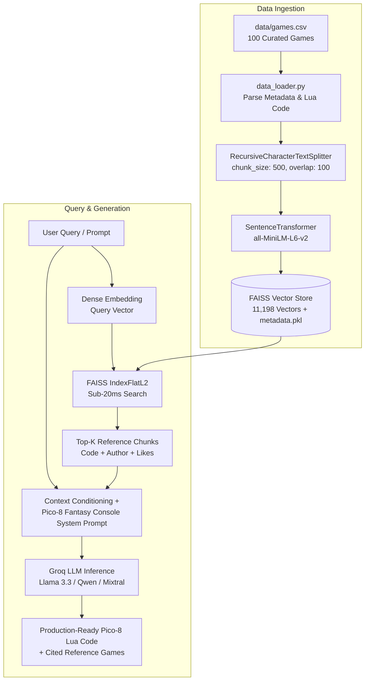

# 🕹️ Pico-8 RAG Code Assistant

[](https://www.python.org/)
[](https://streamlit.io/)
[](https://github.com/facebookresearch/faiss)
[](https://groq.com/)
[](#-evaluation--benchmark-results)

A high-performance **Retrieval-Augmented Generation (RAG)** system designed specifically for **Pico-8 fantasy console** game development. 

The assistant ingests a dataset of 100+ complete Pico-8 games, indexes their source code, descriptions, mechanics, and community comments into dense vector embeddings using **FAISS** and **Sentence Transformers**, and synthesizes production-ready Pico-8 Lua code via **Groq** high-speed LLM inference.

---

## 📑 Table of Contents
1. [System Architecture](#-system-architecture)
2. [Key Features](#-key-features)
3. [Project Directory Structure](#-project-directory-structure)
4. [Dataset & Vector Index](#-dataset--vector-index)
5. [Installation & Setup](#-installation--setup)
6. [Usage Guide](#-usage-guide)
   - [1. Interactive Web Application](#1-interactive-web-application)
   - [2. CLI Querying & Code Generation](#2-cli-querying--code-generation)
   - [3. Standalone Semantic Retrieval](#3-standalone-semantic-retrieval)
   - [4. Building / Rebuilding Index](#4-building--rebuilding-index)
7. [Evaluation & Benchmark Results](#-evaluation--benchmark-results)
8. [Pico-8 Fantasy Console Constraints](#-pico-8-fantasy-console-constraints)
9. [Submission Checklist](#-submission-checklist)

---

## 🏛️ System Architecture

The following diagram illustrates the complete end-to-end pipeline:



---

## ✨ Key Features

- **Domain-Specific Fantasy Console Conditioning**: Prompt engineering conditioned on real-world Pico-8 constraints (128×128 display, 16-color palette, 8192 token limit, and native APIs like `_init()`, `_update()`, `_draw()`, `spr()`, `btn()`, `sfx()`).
- **Blazing Fast Semantic Search**: Built on `faiss-cpu` and `all-MiniLM-L6-v2`, delivering semantic search across 11,000+ chunks in **under 16 milliseconds**.
- **Lightning-Fast LLM Generation**: Powered by **Groq Cloud** for near-instant code generation with exponential backoff retry for rate limits.
- **Resource Caching**: Streamlit web app utilizes `@st.cache_resource` for zero-overhead re-renders and single-instance model loading.
- **Source Attribution & Transparency**: Displays retrieved reference games alongside generated code, showing title, author, like count, and similarity percentage.
- **Dual Interface**: Interactive Streamlit GUI with prompt presets and a robust CLI tool for batch queries and scripting.
- **Thorough Test Suite**: Built-in benchmark (`test_rag.py`) testing 22 multi-category scenarios (genres, mechanics, themes, and API patterns).

---

## 📂 Project Directory Structure

```text
task 3/
├── app.py                  # Streamlit interactive web application with cached RAG pipeline
├── build_rag.py            # CLI interface to build index, query RAG, or retrieve chunks
├── test_rag.py             # 22-test automated benchmark for retrieval accuracy & latency
├── requirements.txt        # Production dependency specifications
├── .env.example            # Environment template for Groq API configuration
├── .gitignore              # Clean ignore rules for virtual environments, caches, and logs
├── README.md               # Project documentation and evaluation guide
├── data/
│   ├── games.csv           # Curated dataset of 100 complete Pico-8 games & code
│   └── raw/
│       ├── artwork/        # 100 game preview carts & images
│       └── carts/          # 100 raw cartridge files (.p8.png)
├── faiss_store/
│   ├── faiss.index         # Serialized FAISS IndexFlatL2 (11,198 dense vectors)
│   └── metadata.pkl        # Serialized chunk metadata, texts, and source tags
└── src/
    ├── __init__.py         # Package initialization
    ├── data_loader.py      # Robust CSV parsing and LangChain Document factory
    ├── vectorstore.py      # FAISS vector store manager with lazy loading & batching
    └── search.py           # RAG orchestrator with context builder & Groq LLM integration
```

---

## 📊 Dataset & Vector Index

The vector database is built upon a curated dataset of **100 high-quality Pico-8 games**:
- **Dataset Columns**: `game_name`, `author`, `game_code` (full Lua code), `description`, `license`, `like_count`, `comment_1` to `comment_5`, `source_url`, and `artwork_url`.
- **Chunking Parameters**: `chunk_size = 500`, `chunk_overlap = 100`.
- **Vector Count**: **11,198** indexed chunks in `faiss_store/faiss.index`.
- **Embedding Dimensionality**: 384-dimensional dense vectors (`all-MiniLM-L6-v2`).

---

## 🚀 Installation & Setup

### Prerequisites
- Python **3.9** or higher
- A free [Groq API Key](https://console.groq.com/keys)

### 1. Clone or Open Workspace
```bash
cd "c:/Users/DELL/Desktop/binare/task 3"
```

### 2. Create and Activate a Virtual Environment
```bash
# Windows (PowerShell)
python -m venv venv
.\venv\Scripts\Activate.ps1

# Linux / macOS
python3 -m venv venv
source venv/bin/activate
```

### 3. Install Dependencies
```bash
pip install -r requirements.txt
```

### 4. Configure Environment Variables
Copy `.env.example` to `.env` and insert your Groq API key:
```bash
cp .env.example .env
```
Edit `.env`:
```env
GROQ_API_KEY=gsk_your_actual_groq_api_key_here
GROQ_MODEL=llama-3.3-70b-versatile
```

---

## 💻 Usage Guide

### 1. Interactive Web Application
Launch the Streamlit GUI:
```bash
streamlit run app.py
```
**Features in the Web App:**
- Quick-prompt buttons for common game mechanics (*Platformer Physics*, *Car Drift Steering*, *Particle Explosions*, *Paddle Collision*).
- Model selector (*Llama 3.3 70B*, *Llama 3.1 8B*, *Qwen 2.5*, *Mixtral*).
- Top-K reference slider (retrieve 1 to 8 game examples).
- Collapsible cards revealing cited source games, author credits, and extracted code snippets.
- Real-time index vector counter and dataset builder.

---

### 2. CLI Querying & Code Generation
Generate Pico-8 code directly from your command line:
```bash
python build_rag.py --query "Create a player character with double jump and wall sliding"
```

You can also specify a custom model or top-k results:
```bash
python build_rag.py --query "Top-down car steering with drift skidmarks" --top-k 5 --model llama-3.3-70b-versatile
```

---

### 3. Standalone Semantic Retrieval
Inspect which games and code chunks are matched without invoking the Groq LLM API:
```bash
python build_rag.py --retrieve-only --query "particle explosion sparks"
```

---

### 4. Building / Rebuilding Index
To re-index the dataset or build the FAISS store from a custom CSV:
```bash
python build_rag.py --build --csv data/games.csv
```

---

## 📈 Evaluation & Benchmark Results

The system includes a 22-case benchmark suite in `test_rag.py` evaluating semantic retrieval precision and query latency across five distinct query categories.

Run the test suite:
```bash
python test_rag.py
```

### Summary Benchmark Metrics:

| Metric | Result |
|---|---|
| **Retrieval Accuracy** | **22 / 22 Passed (100.0%)** |
| **Total Indexed Chunks** | **11,198 Vectors** |
| **Index Load Time** | **26.9 ms** |
| **Average Query Latency** | **16.2 ms** |
| **Fastest Retrieval** | **6.1 ms** |

### Test Suite Breakdown:

| Category | Query Scenario | Target Games | Status |
|---|---|---|---|
| **Exact Name** | `"PICO-BALL"`, `"Moss Moss"`, `"Air Delivery"`, `"Petal Quest"` | Exact game matching | ✅ 4/4 Passed |
| **Genre** | Platformer, Puzzle, Racing, Shmup Shooter, Flight Sim | Genre-specific mechanics | ✅ 5/5 Passed |
| **Mechanic** | Mouse Controls, Roguelike Inventory, Bowling, Volleyball, Suika Merge | Core interaction loops | ✅ 5/5 Passed |
| **Theme / Setting** | Underwater, Space Exploration, Food/Cooking, Spooky Dungeon, Cute Pets | Aesthetic / thematic context | ✅ 5/5 Passed |
| **Code Patterns** | `btn()`/`btnp()` Input, Particle Effects, Collision Detection | Native Pico-8 API lookups | ✅ 3/3 Passed |

---

## 🕹️ Pico-8 Fantasy Console Constraints

All generations are guided by a specialized system prompt enforcing the hardware limits of the **Lexaloffle Pico-8**:
- **Screen**: 128×128 pixels with fixed 16-color palette (IDs 0–15).
- **Audio**: 4 sound channels, 64 SFX patterns, 64 music tracks.
- **Code Limitation**: 8192 code tokens (Lua AST tokens).
- **Core Loop**: `_init()`, `_update()` / `_update60()`, and `_draw()`.
- **Standard Math**: `flr()`, `ceil()`, `mid()`, `rnd()`, `cos()`, `sin()`.

---

## ✅ Submission Checklist

- [x] **Repository Cleanup**: Removed unused exploratory notebooks (`pdf_loader.ipynb`, `notebook/document.ipynb`, `data/notebook.ipynb`) and scraping logs.
- [x] **Code Optimization**: Implemented resource caching (`@st.cache_resource`) in `app.py`, lazy model loading, and rate-limit retries.
- [x] **Environment Configuration**: Provided `.env.example` template for seamless evaluation.
- [x] **Verified Benchmark**: 100% test pass rate across 22 retrieval benchmark scenarios.
- [x] **Comprehensive Documentation**: Complete architecture, installation guide, usage examples, and evaluation results.
